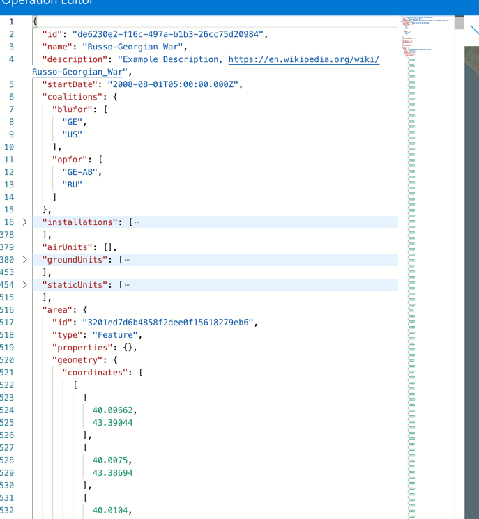
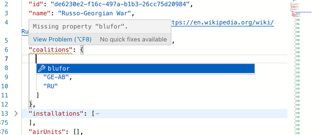
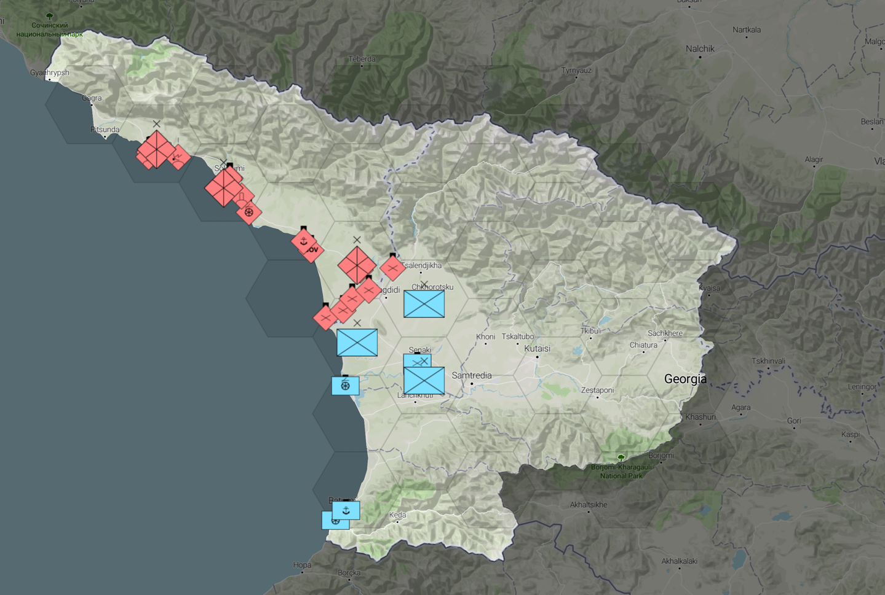

# War Room - Operation Editor

Operation Editor App to create War Room Operation Files

Visit the site @ https://flying-dice.github.io/war-room-operation-planner/

## Additional Resources

- https://www.geoboundaries.org/ - Useful Importable GeoJSON files for countries
- https://mapshaper.org/ - Useful for modifying and simplifying GeoJSON Files

## Usage

A fictional war on the Georgia Abkhazia border is initially loaded. Replace it with a saved 
scenario or customize as necessary.

The operation is defined in the editor pane, it has autocomplete and a JSON Schema defined to 
assist with scenario creation. 

It will inform of errors at runtime and enforce all required fields.

For example here we have an invalid coalitions property.

The Game Grid is automatic and covers the GeoJSON feature as defined in the opertations `area` 
property. This can be a square for example, or any other polygon, i.e. a nations borders 
yielding a grid like so.

To see the full specification of the OperationFile see the OperationFile model.

https://github.com/flying-dice/war-room-models/blob/main/docs/models-definitions-operation-file.md

https://github.com/flying-dice/war-room-models/blob/main/src/operation-file.ts
